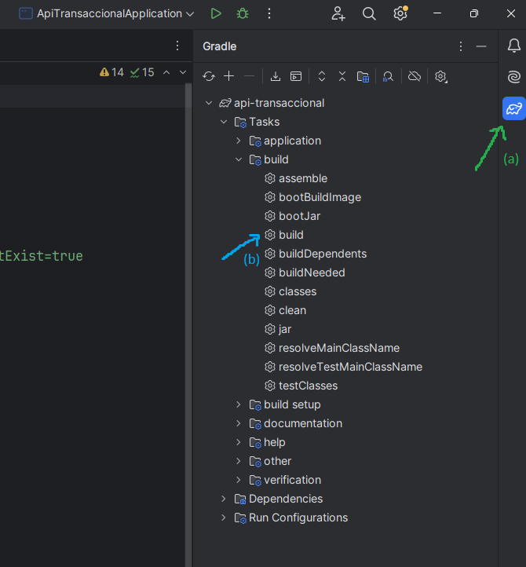

# PuntoPay - Backend

## Descripción del Proyecto

PuntoPay es una API desarrollada en **Spring Boot** que se encarga de gestionar las transacciones de recargas móviles, compra de pines y operaciones bancarias consumiendo los servicios de **Puntored**.

Esta API maneja la autenticación, validaciones de transacciones y almacenamiento de datos en una base de datos MySQL.

## Tecnologías Utilizadas

- **Java 17** - Lenguaje de programación.
- **Spring Boot 3.4.3** - Framework para el desarrollo del backend.
- **Spring Data JPA** - Manejo de persistencia de datos.
- **Spring Security** - Seguridad y autenticación.
- **Spring Validation** - Validaciones en el backend.
- **Spring Cloud OpenFeign** - Cliente HTTP declarativo para la comunicación con la API de Puntored.
- **Spring Cloud Netflix Eureka Client** - Para la comunicación con un servidor de descubrimiento.
- **JWT con Auth0 (JSON Web Token)** - Manejo de autenticación.
- **MySQL** - Base de datos relacional.
- **Lombok** - Reducción de boilerplate en Java.

## Requisitos Previos

Antes de ejecutar el backend, asegúrate de tener:

- **JDK 17** o superior.
- **MySQL** como base de datos.
- **Spring Boot 3.4.3**.

## Instalación y Ejecución

### 1. Clonar el repositorio y abrir en IntelliJ IDEA
```sh
git clone https://github.com/stiven4950/puntopay-backend.git
cd puntopay-backend
```
Luego, ir a la IDE IntelliJ IDEA y seleccionar en **abrir**. Finalmente buscar el archivo *build.gradle* y seleccionar que se desea abrir como un proyecto. Finalmente, esperar a que se instalen las dependencias.

### 2. Configurar variables de entorno
Crea una base de datos en MySQL y asegúrete de configurar el archivo `application.properties` con las credenciales correctas:
```properties
spring.application.name=api-transaccional
server.port=3000
server.servlet.context-path=/puntored-transactional/api

spring.datasource.url=jdbc:mysql://localhost:3306/api-transactional?createDatabaseIfNotExist=true
spring.datasource.username=tu_usuario
spring.datasource.password=tu_contraseña

spring.datasource.driver-class-name=com.mysql.cj.jdbc.Driver
spring.jpa.hibernate.ddl-auto=update
logging.level.org.springframework.security.web.*=debug

puntored.endpoint=https://services.preprodcxr.co/puntored/api/v1
puntored.usuarioHost=usuario_host
puntored.claveHost=clave_host
puntored.comercio=el_comercio
puntored.puntoVenta=punto_de_venta
puntored.claveTransaccional=tu_clave
puntored.terminal=la_terminal

eureka.client.enabled=false

cors.allowed.origins=http://localhost:4200
cors.allowed.methods=GET,POST,PUT,DELETE
cors.allowed.headers=*
```

### 3. Construir y ejecutar la API

Compila y ejecuta el backend desde la IntelliJ IDEA o bien, podrías construir la imagen Docker con:
1. Entra a las opciones gradle de tu proyecto desde IntelliJ IDEA

- a) Dirigirse al ícono de gradle
- b) Doble click sobre *build*
2. Ejecuta los comandos de Docker para construir y correr el contenedor
```sh
docker build -t puntopay-backend .
docker run -d -p 3000:3000 puntopay-backend
```

**NOTA**: Cuando se ejecuta con Docker, no olvides especificar las variables de entorno ya sea por línea de comandos o através de la interfaz de Docker:
- DATABASE_URL
- DATABASE_USERNAME
- DATABASE_PASSWORD
- PUNTORED_ENDPOINT
- PUNTORED_USUARIO_HOST
- PUNTORED_CLAVE_HOST
- PUNTORED_COMERCIO
- PUNTORED_PUNTO_VENTA
- PUNTORED_CLAVE_TRANSACCIONAL
- PUNTORED_TERMINAL
- CORS_ALLOWED_ORIGINS
- CORS_METHODS
- CORS_HEADERS

La API estará disponible en `http://localhost:3000/`. Con esto ya podrás usar este enpoint para conectarla a tu cliente.
La ruta de contexto es: `/puntored-transactional/api`

## Rutas:
- **Login**: *POST* `/auth/login`
- **Registration User**: *POST* `/user/registration`
- **List Suppliers**: *GET* `/recharge/suppliers`
- **Buy Recharge**: *POST* `/recharge/buy`
- **History Transactions**: *GET* `/transactions`

## Documentación
Puedes consultar cómo usar esta API a través de la documentación en Postman: https://documenter.getpostman.com/view/9408000/2sAYkGKK8w

## Contacto

Desarrollado por **Omar Stiven Rivera Rocha**  
**Ingeniero de Software**